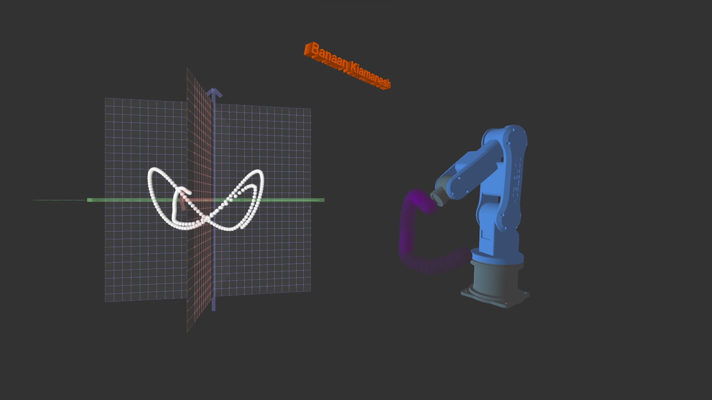

# Robot Arm Inverse Kinematics

### **Project Purpose**:
This was supposed to be a project for my **Modelling and Control of Robotic Systems**.

But that didn't happen. And in the end, it was just a fun experiment.

### **Description**:
Firstly, The thing contains of 2 parts:
1. Plot that shows the position of end-effector in the 3d space.
2. The robot arm itself. The end effector position is generated and the angles of the joints are calculated using the **inverse kinematics** and then all the translations andd rotations are being applied.

### **Modes**:
There are some modes that can be applied on the robot arm after the simulation is started:

1. **"l"** ==> End effector periodically moves on a line.

2. **"e"** ==> End effector periodically moves on an ellipse.

3. **"i"** ==> End effector periodically moves on an infinity.

4. **"r"** ==> A random point is generated and the end effector slowly moves to that point.

5. **"z"** ==> Both the plot and the robot can be rotated in the space. If 'z' is pressed then the rotation is reseted into 0 immediately.